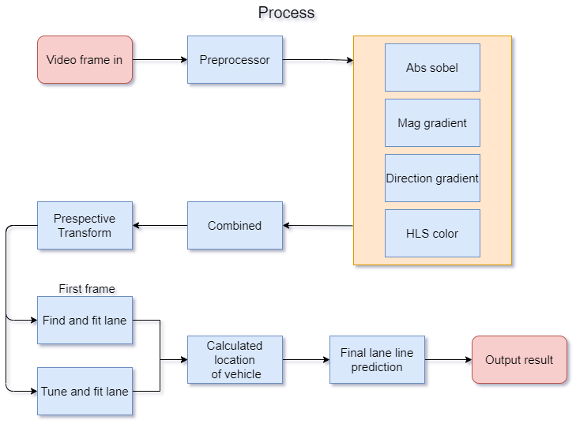

# Enviroment
- Python 3.7.6
- Module
    - numpy
    - OpenCV
    - Matplotlib
    - pickle
    - moviepy
    - tkinter
# Source
- GUI
    - Read file
    - Kernel
    - Display Result
- Main: process management
- Combined_thresh: return binary_img
- Perspective_transform: transform 3D to 2D image
- Line: create class Line
- Line_fit: Find and fit lane lines

# Run
`python GUI.py`
